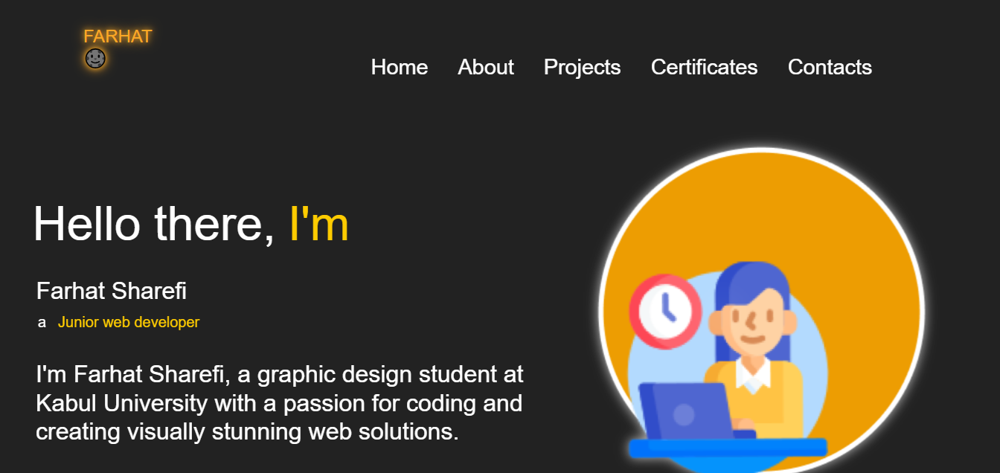

# FarhatSharefi-PersonalPortfolio
This is J.S capstone project about my Personal Portfolio

#Project Title 🚀
FarhatSharefi-PersonalPortfolio

## Project Description 📝
This portfolio showcases my journey in graphic design and web development, featuring a range of interactive and visually appealing projects. The design is a collaborative effort with my talented UX/UI friends on Figma, ensuring a user-centric and modern aesthetic. Explore to see the blend of creativity and technical skills in each project.

## Demo 📸
[Live Demo]()

## Technologies Used 🛠️

- HTML

- CSS

- java script

## Installation 💻

Installation and Setup Instructions:

Clone the Repository:

Navigate to the Project Directory:

cd FarhatSharefi-PersonalPortfolio

## Usage 🎯

Step 1: Find and Access the Repository

Navigate to the Repository:

Open your web browser and go to GitHub.

Use the search bar to find the repository you want to use, or navigate 
directly to the repository's URL.

Step 2: Clone the Repository

Copy the Repository URL:

On the repository's main page, click the green "Code" button.

Copy the URL 

Clone the Repository to Your Local Machine:

Open your terminal or command prompt.

Navigate to the directory where you want to clone the repository.

Replace repository with the name of the cloned repository

## Features ⭐
. Interactive Toolbar and Headline Section: A sleek and engaging introduction to my portfolio.

. About Me Section: An insightful overview of my background, interests, and skills.

. Works Section: A showcase of my diverse projects in both design and development.

. Projects Popup: Detailed views of individual projects, highlighting processes and outcomes.

. Responsive Design: Ensuring optimal viewing experience across various devices.

. Contact Form: A convenient way to get in touch with me for collaborations or inquiries.

Feel free to modify or expand on these features as needed!
 

## Author 👩‍💻
- [Linkedin](https://www.linkedin.com/in/farhat-sharefi-13a101309?utm_source=share&utm_campaign=share_via&utm_content=profile&utm_medium=android_app)
- [Email](sharefifarhat@gmail.com)

## UI/UX Author 👩‍💻 
- Name: Maryam Tarakhail
- LinkedIn: [Maryam Trakhail](https://www.linkedin.com/in/maryam-tarakhail-098a992a8?utm_source=share&utm_campaign=share_via&utm_content=profile&utm_medium=android_app)
- Email: [email]( Maryamtarakhail2021@gmail.com)

- Name: Sumaya Farahmand
- LinkedIn: [Sumaya farahmand](https://www.linkedin.com/in/maryam-tarakhail-098a992a8?utm_source=share&utm_campaign=share_via&utm_content=profile&utm_medium=android_app)
- Email: [email]( s.frahmand2003@gmail.com)
 

-Name: Aminah
- Email: [email](Emaansailab@gmail.com )
